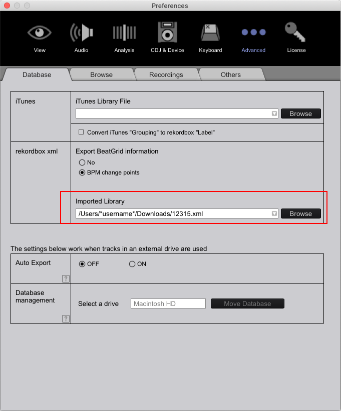

# MixEngine xPort User Guide (Test)

[Download (MixEngine xPort v0.0.1 Alpha)](https://github.com/MixEngine/xport-development/releases/download/0.0.1/mixengine_xport.dmg)

MixEngine xPort는 DJ들의 플레이리스트와 큐를 여러 DJ프로그램 간에 호환 및 관리할 수 있도록 돕습니다.  
※ **현재 macOS에서만 사용 가능합니다.** 또한, 사용자 경험 개선을 위하여 프로그램 사용성 데이터를 개발자 서버(MixEngine Inc.)에 전송하게 되며, 다운로드는 이에 동의한 것으로 간주됩니다.

- [Menu](#menu)
- [How to](#how-to)
    - [음원 및 플레이리스트 추가 (Import)](#음원-및-플레이리스트-추가-import)
        - [Serato](#from-serato-crate)
        - [Traktor](#from-ni-traktor-3-nml)
        - [Rekordbox](#from-pioneer-rekordbox-xml)
    - [플레이리스트 내보내기 (Export)](#플레이리스트-내보내기-export)
        - [Serato](#to-serato)
        - [Traktor](#to-ni-traktor-3)
        - [Rekordbox](#to-ni-traktor-3)
- [유의사항](#유의사항)

# Menu

MixEngine xPort는 Library, Playlists 로 구성되어 있습니다.

**≡ Library**는 본인이 소유한 음원을 검색을 통해 보다 빠른 Playlist 관리를 할 수 있습니다.

**Playlists**는 본인만의 플레이리스트를 각기 다른 DJ 소프트웨어 환경에서도 이용할 수 있도록 돕습니다.

# How to

## 음원 및 플레이리스트 추가 (Import)

**Settings** 메뉴의 **Import Music**에 위치한 **Add music to the library**를 클릭하거나 파일 혹은 폴더를 드래그하여 본인이 소유한 음원이나 Playlist를 추가할 수 있습니다.

## 플레이리스트 불러오기 (Import)

Serato, NI Traktor 3, Pioneer Rekordbox 에서 저장된 플레이리스트를 xPort로 불러올 수 있습니다.

### From Serato (*.crate)

   Serato의 플레이리스트 파일 경로는 ***음악 \\ \_*Serato*\_ \\ Subcrates*** 입니다. 해당 폴더에 존재하는 (플레이리스트명).crate 파일을 xPort로 Import 시킬 경우 플레이리스트 내에 존재하는 라이브러리와 플레이리스트가 xPort에 추가됩니다.

   

   Serato 내에서 지정한 각 곡의 Cue 역시 함께 추가되며, 기존 라이브러리와 중복되는 내용이 존재한다면, 해당 정보는 이동되지 않습니다. 만약 새로운 곡 정보로 수정을 원하신다면 기존에 라이브러리에 존재하는 내용은 미리 제거하여 주시기 바랍니다. 

   

### From NI Traktor 3 (*.nml)

   

   NI Traktor 3 내에서 해당하는 플레이리스트에 보조 클릭 메뉴의 **Export Playlist**를 선택합니다. 저장경로를 지정한 후 해당 파일을 xPort로 Import 시킬 경우 플레이리스트 내에 존재하는 라이브러리와 플레이리스트가 xPort에 추가됩니다.

   

   NI Traktor 3 내에서 지정한 각 곡의 Cue 역시 함께 추가되며, 기존 라이브러리와 중복되는 내용이 존재한다면, 해당 정보는 이동되지 않습니다. 만약 새로운 곡 정보로 수정을 원하신다면 기존에 라이브러리에 존재하는 내용은 미리 제거하여 주시기 바랍니다. 

   

### From Pioneer Rekordbox (*.xml)

   상단메뉴의 File - Export Collection in xml format을 통하여 원하는 경로에 플레이리스트 파일을 저장할 수 있습니다. 저장된 파일을 xPort로 Import 시킬 경우 플레이리스트 내에 존재하는 라이브러리와 플레이리스트가 xPort에 추가됩니다.

   

   Rekordbox 내에서 지정한 각 곡의 Cue 역시 함께 추가되며, 기존 라이브러리와 중복되는 내용이 존재한다면, 해당 정보는 이동되지 않습니다. 만약 새로운 곡 정보로 수정을 원하신다면 기존에 라이브러리에 존재하는 내용은 미리 제거하여 주시기 바랍니다. 

   

## 플레이리스트 내보내기 (Export)

플레이리스트는 xPort를 통해 다른 소프트웨어와 호환되는 파일로 다시 내보낼 수 있습니다. 해당하는 플레이리스트를 보조 클릭 메뉴를 실행하여 각 소프트웨어에 해당하는 형태의 파일로 저장합니다.

### To Serato

   Export (serato)를 선택하여 해당 파일을 ***음악 \\ \_*Serato*\_ \\ Subcrates*** 에 저장합니다. Serato를 실행시키면 해당 플레이리스트는 자동으로 Serato의 라이브러리 안에 보여집니다.

### To NI Traktor 3

   

   Export (traktor)를 선택하여 해당 파일을 원하는 위치에 저장합니다. Traktor 3를 실행하여 Explorer내에 Playlists를 보조 선택 클릭한 뒤 Import Playlist를 선택한 뒤 해당 파일을 불러오면 Traktor의 Playlist 안에 추가됩니다.

### To Pioneer Rekordbox

   

   Export (rekordbox)를 선택하여 해당 파일을 원하는 위치에 저장합니다.  Rekordbox를 실행하여 상단 메뉴의 rekordbox - Preferences로 진입합니다.

   

   Preferences의 Advanced 탭으로 진입하여 rekordbox xmi 메뉴의 Imported Library에 해당파일을 지정합니다.

   

   이후 상단메뉴의 Playlist에서 Import Playlist를 선택하면 해당 플레이리스트가 본인의  플레이리스트에 전달됩니다.

# 유의사항

1. 라이브러리에 이미 추가되어 있는 곡은 Import 통해 불러와도 기존의 내용에 덮어씌워지지 않습니다.
    - 해당하는 곡을 xPort의 라이브러리에서 제외시킨 후 다시 Import를 하면 정상적으로 로드됩니다.
